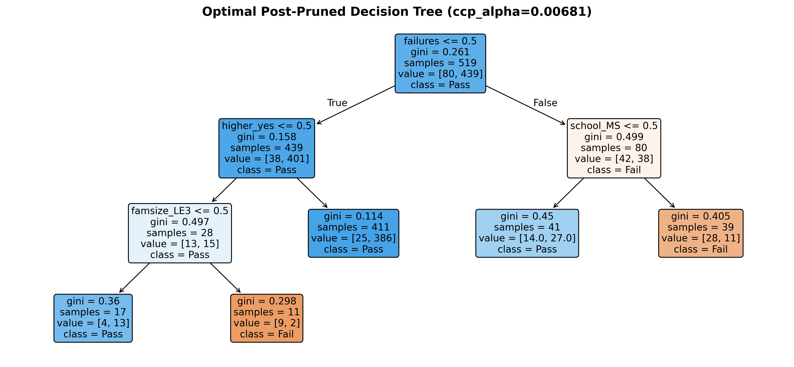
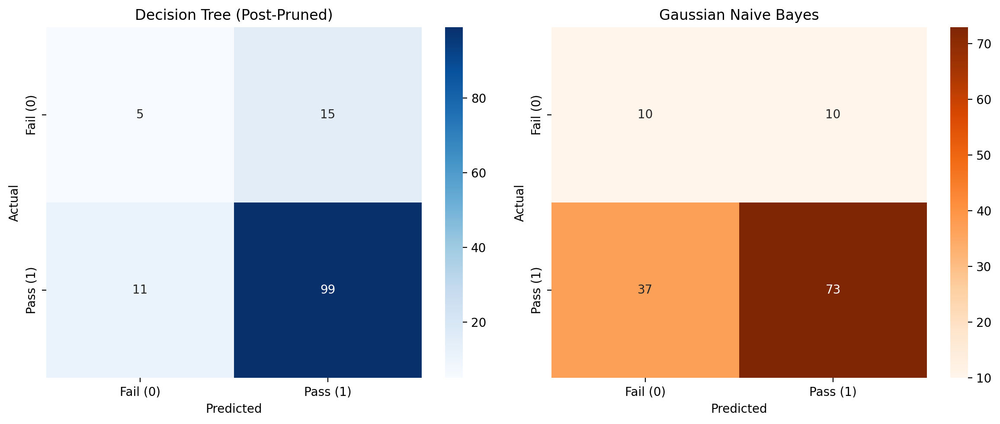
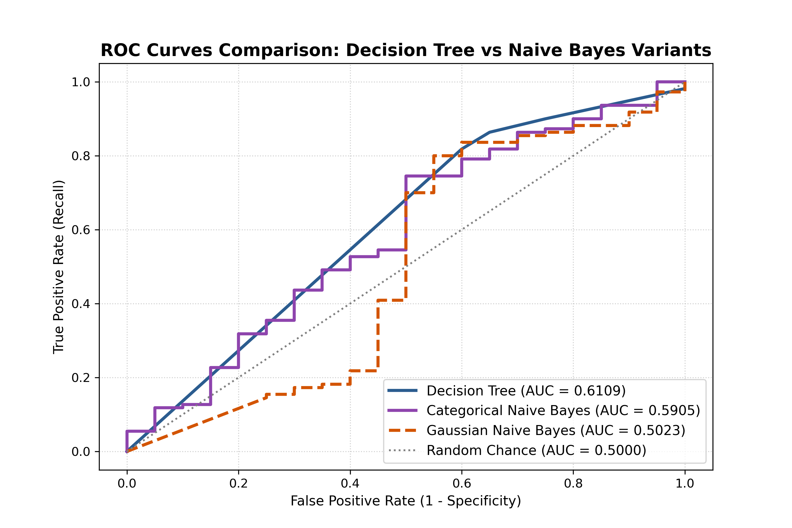
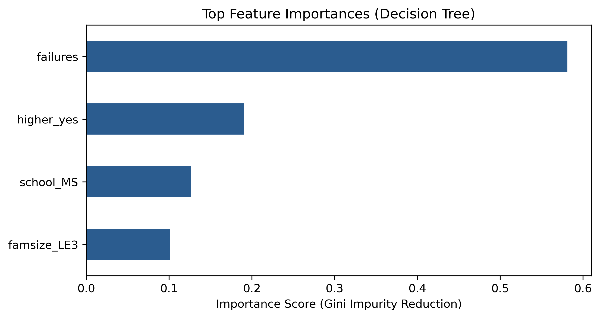

# 🎓 Student Academic Performance Prediction: Pass or Fail?
> **Data Mining Project:** การทำนายผลการเรียนของนักเรียน (สอบผ่าน vs สอบไม่ผ่าน) โดยเปรียบเทียบระหว่างโมเดล **Decision Tree (Rule-based)** และ **Naive Bayes (Probabilistic)**

[](https://www.python.org/)
[](https://scikit-learn.org/)
[](https://www.kaggle.com/datasets/uciml/student-alcohol-consumption)
[](LICENSE)

---

## 📌 1. บทนำและเป้าหมายของโครงงาน (Project Overview)
* **ปัญหาทางธุรกิจ/การศึกษา:** โรงเรียนต้องการระบบคัดกรองนักเรียนที่มีความเสี่ยงจะสอบตกตั้งแต่ต้นภาคการศึกษา (**Early Warning System**) เพื่อให้ครูที่ปรึกษาสามารถยื่นมือเข้าไปช่วยเหลือและวางแผนติวเสริมได้ทันท่วงที
* **แหล่งข้อมูล (Dataset):** [Student Alcohol Consumption / Student Performance (Kaggle/UCI)](https://www.kaggle.com/datasets/uciml/student-alcohol-consumption) ข้อมูลนักเรียนวิชาภาษาโปรตุเกส (`student-por.csv`) จำนวน **649 แถว และ 33 ตัวแปร**
* **เป้าหมาย (Target Variable):** คะแนนสอบปลายภาค `G3` โดยแบ่งเป็น:
  * `Pass (1)`: คะแนน $\ge 10$ (คิดเป็น 84.6% ของนักเรียนทั้งหมด)
  * `Fail (0)`: คะแนน $< 10$ (คิดเป็น 15.4% ของนักเรียนทั้งหมด)
* **การป้องกัน Data Leakage:** ตัดคะแนนสอบย่อย $G1$ และ $G2$ ออกจากตัวแปรทำนาย เพื่อบังคับให้โมเดลทำนายจากพฤติกรรม สภาพแวดล้อมครอบครัว และประวัติการขาดเรียนตั้งแต่เริ่มเปิดเทอม

---

## 👥 2. สมาชิกและการแบ่งงานบน GitHub Branches
การทำงานถูกแยกออกเป็น Branch เพื่อการทำงานร่วมกันแบบมืออาชีพ:

| สมาชิก | Branch | ความรับผิดชอบและสมุดบันทึก (Notebook) |
| :--- | :--- | :--- |
| **ส่วนร่วมกัน** | `main` | วางโครงสร้างโปรเจกต์, ทำ EDA, ทำความสะอาดข้อมูล, และวิเคราะห์เปรียบเทียบ (`01_eda_and_data_cleaning.ipynb`, `04_model_comparison.ipynb`) |
| **คนที่ 1 (`bosskitti`)** | `feature/decision-tree` | พัฒนาโมเดล Decision Tree, ทำ Pre-pruning (`max_depth`), Post-pruning (`ccp_alpha`), พล็อตต้นไม้ และวิเคราะห์ Feature Importance (`02_decision_tree_model.ipynb`) |
| **คนที่ 2 (`S-Jiraarsavakaew`)** | `feature/naive-bayes` | พัฒนาโมเดล Naive Bayes ทั้ง `GaussianNB` และ `CategoricalNB` ร่วมกับการทำ Discretization, วิเคราะห์ Permutation Importance และเปรียบเทียบผลลัพธ์ (`03_naive_bayes_model.ipynb`) |

---

## 📂 3. โครงสร้างโฟลเดอร์ของโปรเจกต์ (Repository Structure)
```text
student-grade-prediction/
│
├── .gitignore                          # รายการไฟล์ที่ไม่ต้องการดันขึ้น Git
├── requirements.txt                    # รายการ Dependencies ทั้งหมด
├── README.md                           # เอกสารอธิบายโปรเจกต์ฉบับสมบูรณ์
│
├── data/
│   ├── raw/                            # ข้อมูลดิบ student-por.csv จาก Kaggle
│   └── processed/                      # ข้อมูล train.csv และ test.csv หลังทำ Preprocessing
│
├── notebooks/
│   ├── 01_eda_and_data_cleaning.ipynb  # (ทำร่วมกัน) EDA, Data Cleaning, Outliers (IQR), One-Hot
│   ├── 02_decision_tree_model.ipynb   # (คนที่ 1) Decision Tree, Pruning, plot_tree, Gini vs Entropy
│   ├── 03_naive_bayes_model.ipynb     # (คนที่ 2) GaussianNB vs CategoricalNB with Discretization
│   └── 04_model_comparison.ipynb      # (ทำร่วมกัน) ประชันผลลัพธ์ Head-to-Head และสรุปเชิงนโยบาย
│
└── images/                             # กราฟความละเอียดสูงสำหรับรายงานและสไลด์
    ├── outliers_boxplot.png            # การตรวจจับ Outlier ด้วย IQR
    ├── correlation_heatmap.png         # Heatmap แสดงสหสัมพันธ์
    ├── tree_structure.png              # แผนผังต้นไม้การตัดสินใจหลังทำ Pruning
    ├── feature_importance.png          # กราฟแท่งแสดงค่าน้ำหนักตัวแปร
    ├── confusion_matrices.png          # Confusion Matrix เปรียบเทียบสองโมเดล
    └── roc_curves.png                  # เส้นกราฟ ROC Curves เปรียบเทียบ
```

---

## 📊 4. สรุปผลการทดลองจริง (Head-to-Head Experimental Results)

การทดสอบทำบนชุดทดสอบมาตรฐาน (**Test Set จำนวน 130 คน**: สอบผ่านจริง 110 คน, สอบตกจริง 20 คน):

| ตัวชี้วัด (Metric) | Decision Tree (Unpruned) | Decision Tree (Post-Pruned) | Gaussian Naive Bayes | Categorical Naive Bayes (Discretized) 🌟 |
| :--- | :---: | :---: | :---: | :---: |
| **Training Accuracy** | 1.0000 (Overfit 100%) | 0.8459 | 0.7765 | 0.7842 |
| **Testing Accuracy** | 0.7769 (77.69%) | **0.8000 (80.00%)** | 0.6385 (63.85%) | **0.7692 (76.92%)** 🚀 |
| **Precision (Pass)** | 0.8584 | 0.8684 | **0.8795** | 0.8655 |
| **Recall (Pass)** | 0.8818 | **0.9000** | 0.6636 | 0.8545 |
| **Precision (Fail)** | 0.2500 | 0.3125 | 0.2128 | **0.2727** |
| **Recall (Fail) ⚠️** | 0.2000 (จับได้ 4/20) | 0.2500 (จับได้ 5/20) | **0.5000 (จับได้ 10/20)** 🏆 | 0.3000 (จับได้ 6/20) |
| **F1-Score (Macro)** | 0.5409 | **0.7294** | 0.5275 | **0.5740** |
| **ROC-AUC Score** | 0.5409 | **0.6818** | 0.5023 | **0.5905** |

### 🖼️ ภาพผลลัพธ์สำคัญ (Key Visualizations)
| แผนผังต้นไม้การตัดสินใจ (Decision Tree) | การเปรียบเทียบ Confusion Matrices |
| :---: | :---: |
|  |  |

| การเปรียบเทียบเส้น ROC Curves | ค่าน้ำหนักความสำคัญของตัวแปร (Feature Importance) |
| :---: | :---: |
|  |  |

---

## 💡 5. บทสรุปและการค้นพบองค์ความรู้ (Key Insights & Discussion)

### 5.1 การวิเคราะห์โมเดล Decision Tree (คนที่ 1):
* **การแก้ปัญหา Overfitting:** ต้นไม้เดี่ยวที่ปล่อยให้เติบโตตามธรรมชาติเกิด Overfitting 100% ทันที แต่การใช้เทคนิค **Cost-Complexity Pruning (`ccp_alpha = 0.00681`)** ร่วมกับ 5-Fold Cross-Validation ช่วยตัดกิ่งย่อยที่ซับซ้อนทิ้งไป ทำให้ Test Accuracy เพิ่มขึ้นเป็น **80.00%**
* **ตัวแปรที่มีอิทธิพลสูงสุด:**
  * **`failures` (ประวัติการสอบตก):** มีน้ำหนักสูงถึง **58.1%** ชี้ชัดว่าผลการเรียนในอดีตคือตัวทำนายอนาคตที่แม่นยำที่สุด
  * **`higher_yes` (ความต้องการเรียนต่อ):** มีน้ำหนัก **19.1%** สะท้อนถึงเป้าหมายและแรงจูงใจทางการศึกษาของนักเรียน

### 5.2 การวิเคราะห์โมเดล Naive Bayes: Gaussian vs Categorical (คนที่ 2):
1. **ผลของการทำ Discretization (บทที่ 2.7.7):**  
   เมื่อแปลงตัวแปรตัวเลขต่อเนื่อง (`absences` และ `age`) ให้เป็นช่วงหมวดหมู่ แล้วใช้ **`CategoricalNB`** ความแม่นยำพุ่งขึ้นจาก 63.85% ไปเป็น **76.92% (+13.07%)** เนื่องจากตรงกับสมมติฐานทางทฤษฎีของการแจกแจงแบบ Categorical มากกว่าการฝืนใช้ระฆังคว่ำบนข้อมูล 0/1
2. **Accuracy vs Recall (Fail) Trade-off สำหรับ Early Warning:**  
   * **`GaussianNB`** เหมาะสำหรับระบบที่ต้องการ **ความครอบคลุมสูงสุดในการจับเด็กตก (High Recall = 50.0%)** ยอมรับ False Alarm เพื่อไม่ให้มีเด็กสอบตกหลุดรอด
   * **`CategoricalNB`** เหมาะสำหรับระบบที่ต้องการ **ความเสถียรและความแม่นยำรวมสูง (Accuracy = 76.92%)** ไม่ส่งสัญญาณเตือนพร่ำเพรื่อ
3. **ข้อจำกัดของขนาดกลุ่มตัวอย่าง (Sample Size Limitation):**  
   ในชุดทดสอบมีนักเรียนสอบตกจริงเพียง 20 คน ดังนั้นการทายถูก/ผิดต่างกันเพียง 1 คน จะส่งผลต่อค่า Recall ถึง **5.0%** จึงต้องพิจารณาค่า F1-Score (Macro) ร่วมด้วยเสมอ

### 5.3 ข้อเสนอแนะเชิงนโยบายสำหรับโรงเรียน (Actionable Insights):
* โรงเรียนควรนำ Decision Tree เป็นโมเดลหลักเนื่องจากสามารถแสดงผลเป็นกฎ If-Else ที่ครูและผู้ปกครองเข้าใจได้ทันที (**White-Box Model**)
* ควรเปิดใช้ตัวเลือกถ่วงน้ำหนักคลาส (`class_weight='balanced'`) เพื่อช่วยเพิ่มอัตราการตรวจจับนักเรียนกลุ่มเสี่ยงสอบตกให้สูงขึ้น
* ควรเฝ้าระวังนักเรียนที่มี `failures >= 1` และนักเรียนที่ไม่มีเป้าหมายเรียนต่อระดับมหาวิทยาลัย (`higher = no`) เป็นกลุ่มเร่งด่วนอันดับหนึ่ง

---

## 🚀 6. วิธีการติดตั้งและรันโปรเจกต์ (Quickstart)

```bash
# 1. Clone repository นี้มายังเครื่อง
git clone https://github.com/bosskitti/student-grade-prediction.git
cd student-grade-prediction

# 2. ติดตั้ง Dependencies ที่จำเป็น
pip install -r requirements.txt

# 3. เปิดใช้งานผ่าน Jupyter Notebook หรือ JupyterLab
jupyter notebook
```
ลำดับการรันสมุดบันทึก:
1. `notebooks/01_eda_and_data_cleaning.ipynb` $\rightarrow$ เพื่อเตรียมข้อมูลและสร้าง `train.csv`, `test.csv`
2. `notebooks/02_decision_tree_model.ipynb` $\rightarrow$ เพื่อเทรนและประเมิน Decision Tree (คนที่ 1)
3. `notebooks/03_naive_bayes_model.ipynb` $\rightarrow$ เพื่อเทรน GaussianNB & CategoricalNB (คนที่ 2)
4. `notebooks/04_model_comparison.ipynb` $\rightarrow$ เพื่อเปรียบเทียบผลลัพธ์ของทั้งสองโมเดล
