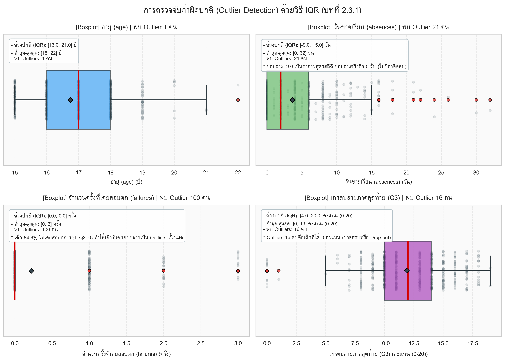
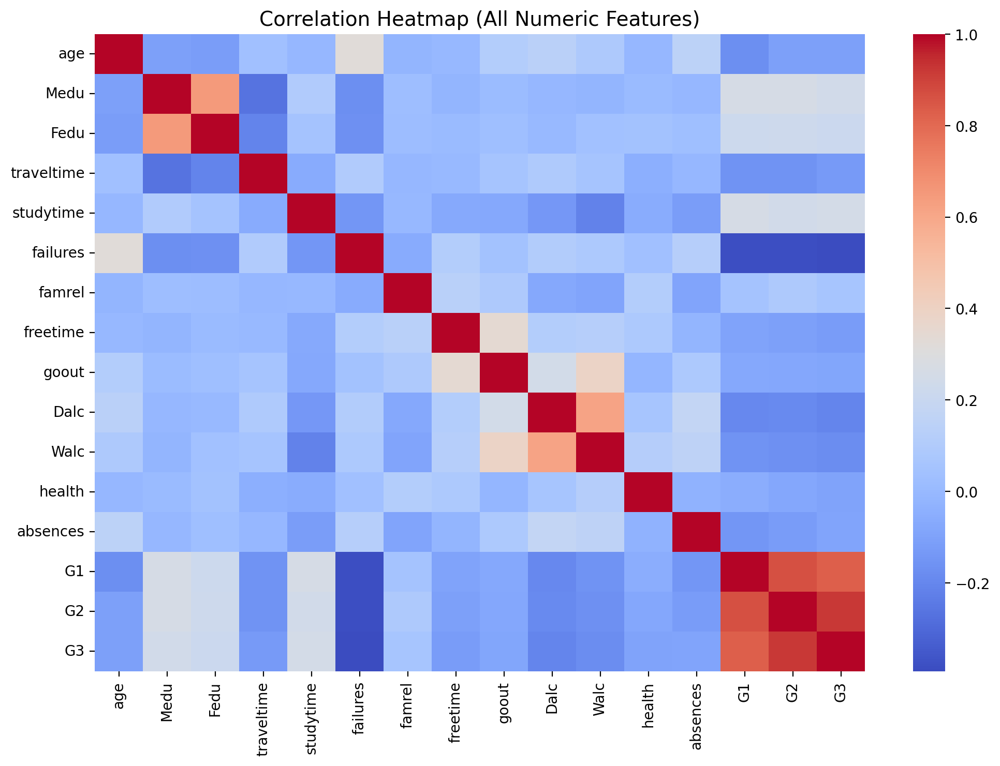
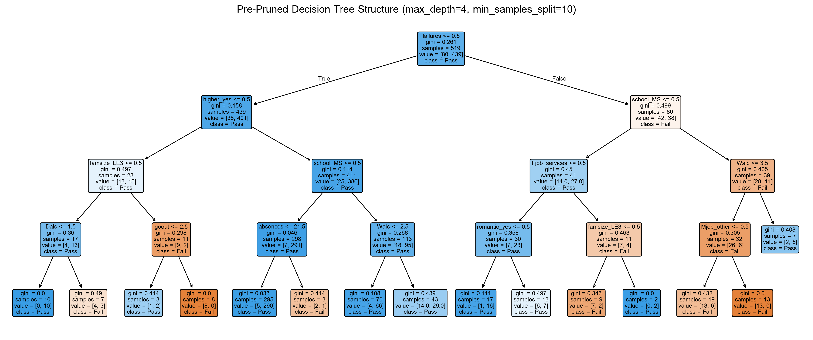
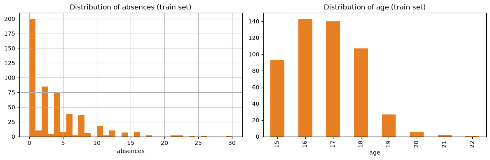
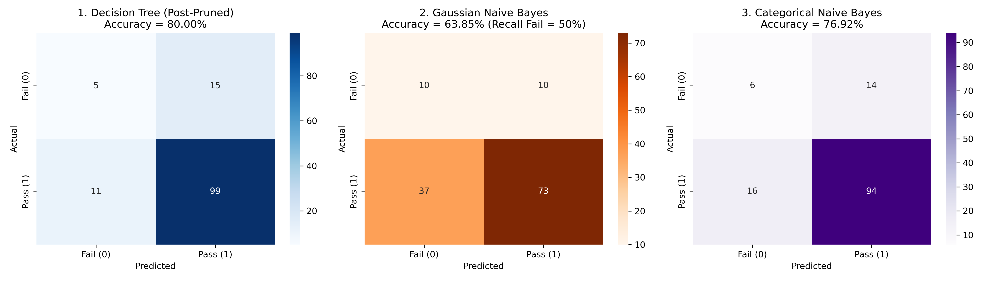
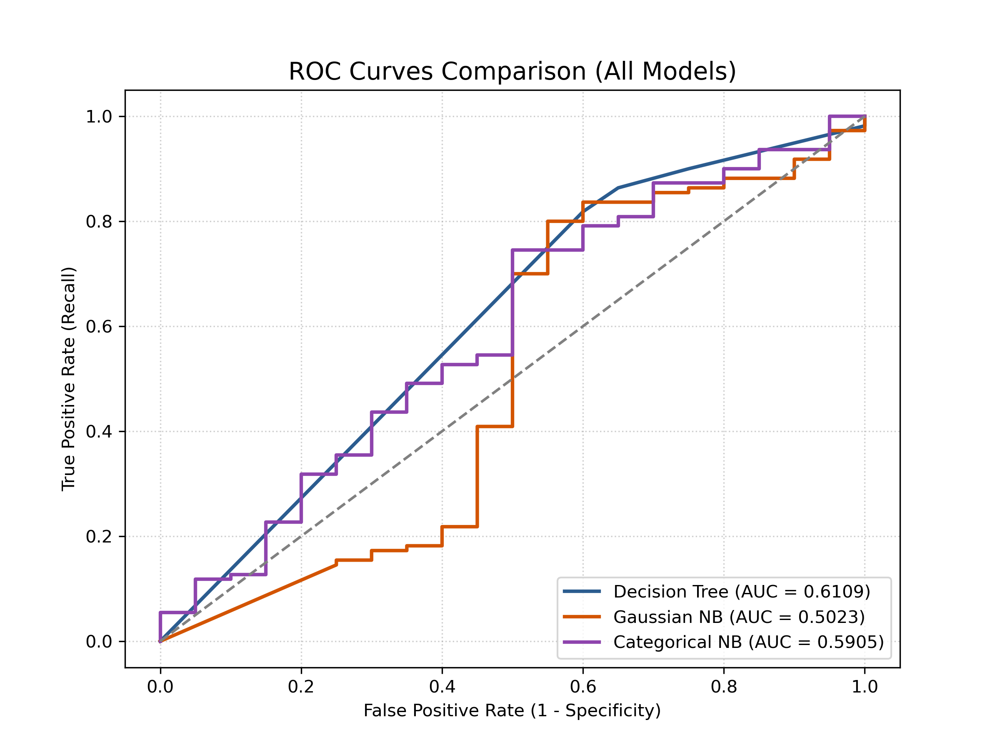

# 🎓 Student Academic Performance Prediction: Early Warning System
> **Data Mining Course Project:** การทำนายผลการเรียนของนักเรียน (สอบผ่าน vs สอบไม่ผ่าน) โดยเปรียบเทียบระหว่างโมเดล **Decision Tree (Rule-based)** และ **Naive Bayes (Probabilistic)**  
> **อาจารย์ผู้สอน:** ดร. กิตติกร (Dr. Kittakorn) | อ้างอิงเนื้อหา: บทที่ 1, 2, 3, 5 และ 6

[](https://www.python.org/)
[](https://scikit-learn.org/)
[](https://www.kaggle.com/datasets/uciml/student-alcohol-consumption)
[](https://github.com/bosskitti/student-grade-prediction/pulls)
[](LICENSE)

---

## 📑 สารบัญ (Table of Contents)
1. [บทนำและที่มาของปัญหา (Project Motivation)](#1-บทนำและที่มาของปัญหา-project-motivation)
2. [การแบ่งหน้าที่ความรับผิดชอบ (Team Contribution & Branches)](#2-การแบ่งหน้าที่ความรับผิดชอบ-team-contribution--branches)
3. [ส่วนที่ทำร่วมกัน: การทำความสะอาดข้อมูลและเตรียมข้อมูล (Data Cleaning & Preprocessing)](#3-ส่วนที่ทำร่วมกัน-การทำความสะอาดข้อมูลและเตรียมข้อมูล-data-cleaning--preprocessing)
4. [เจาะลึกงานคนที่ 1: โมเดล Decision Tree (bosskitti)](#4-เจาะลึกงานคนที่-1-โมเดล-decision-tree-bosskitti)
5. [เจาะลึกงานคนที่ 2: โมเดล Naive Bayes (S-Jiraarsavakaew)](#5-เจาะลึกงานคนที่-2-โมเดล-naive-bayes-s-jiraarsavakaew)
6. [การประเมินและเปรียบเทียบผลลัพธ์ (Head-to-Head Evaluation)](#6-การประเมินและเปรียบเทียบผลลัพธ์-head-to-head-evaluation)
7. [ข้อค้นพบเชิงนโยบายสำหรับโรงเรียน (Actionable Insights)](#7-ข้อค้นพบเชิงนโยบายสำหรับโรงเรียน-actionable-insights)
8. [โครงสร้าง Repository และวิธีรันโปรเจกต์ (Quickstart)](#8-โครงสร้าง-repository-และวิธีรันโปรเจกต์-quickstart)

---

## 1. บทนำและที่มาของปัญหา (Project Motivation)

* **ปัญหาในโลกจริง:** ในระบบการศึกษา การที่นักเรียนสอบตกปลายภาคสร้างผลกระทบทั้งต่อตัวนักเรียน ผู้ปกครอง และชื่อเสียงของสถาบัน หากโรงเรียนต้องรอจนถึงปลายภาคจึงจะทราบผล จะสายเกินกว่าจะช่วยเหลือได้ทัน
* **เป้าหมาย:** สร้าง **ระบบเตือนภัยล่วงหน้า (Early Warning System)** ที่สามารถคัดกรองนักเรียนที่มีความเสี่ยงจะสอบตกได้ตั้งแต่วันแรกที่เปิดภาคเรียน โดยอาศัยเพียงข้อมูลพฤติกรรม สภาพแวดล้อมครอบครัว และประวัติในอดีต
* **ชุดข้อมูล (Dataset):** [Student Alcohol Consumption / Student Performance (Kaggle/UCI)](https://www.kaggle.com/datasets/uciml/student-alcohol-consumption) ข้อมูลนักเรียนวิชาภาษาโปรตุเกส (`student-por.csv`) จำนวน **649 แถว และ 33 ตัวแปร**
* **เป้าหมาย (Target Variable):** คะแนนสอบปลายภาค `G3` (ช่วงคะแนน 0–20) แบ่งเกณฑ์ตามระบบการศึกษาโปรตุเกส:
  * `Pass (1)`: คะแนน $G3 \ge 10$ (จำนวน 549 คน คิดเป็น **84.6%**)
  * `Fail (0)`: คะแนน $G3 < 10$ (จำนวน 100 คน คิดเป็น **15.4%**)

### 1.1 บริบทระบบการศึกษาโปรตุเกสและธรรมชาติของชุดข้อมูล (Educational Domain Knowledge) 🇵🇹
เพื่อความเข้าใจที่ถูกต้องตามหลักสูตรและการแปลผลเชิงวิชาการ โปรเจกต์นี้อ้างอิงตามงานวิจัยต้นฉบับของ **Paulo Cortez & Alice Silva (2008)** และระบบการศึกษาของประเทศโปรตุเกส:

1. **ระบบคะแนนเต็ม 20 (Escala de 0 a 20 valores):**
   * ระบบการศึกษาระดับมัธยมปลายของโปรตุเกส (*Ensino Secundário*, ม.4–ม.6) **ไม่ได้ใช้ระบบคะแนนเต็ม 100 คะแนน** เหมือนของไทย แต่ใช้ **สเกลคะแนน 0 ถึง 20** (เช่นเดียวกับระบบของฝรั่งเศส)
   * เกณฑ์ผ่านขั้นต่ำของกระทรวงศึกษาธิการโปรตุเกสคือ **10 จาก 20 คะแนน (50%)** หากต่ำกว่า 10 คะแนนถือว่าสอบตกทันที
2. **เป็นเกรดของ『วิชาภาษาโปรตุเกส』(ไม่ใช่เกรดเฉลี่ย GPA):**
   * ข้อมูลในไฟล์ `student-por.csv` (`por` = Portuguese) คือผลการเรียนเฉพาะใน **รายวิชาภาษาโปรตุเกส (*Língua Portuguesa*)** ซึ่งเป็นวิชาบังคับแกนหลักรายปีของนักเรียนมัธยมปลาย จาก 2 โรงเรียนรัฐบาลในแคว้น Alentejo ได้แก่ *Gabriel Pereira (GP)* 423 คน และ *Mousinho da Silveira (MS)* 226 คน รวม 649 คน
3. **ระบบ 3 ภาคการศึกษา (Trimester System / 3 Períodos letivos):**
   * ปีการศึกษาของโปรตุเกสแบ่งออกเป็น 3 เทอมตามวันหยุดสำคัญทางศาสนา โดย $G1, G2, G3$ **ไม่ใช่คะแนนสอบย่อยที่เอามาบวกสะสมกันเป็น 60 คะแนน** แต่ละตัวคือ **"เกรดสรุปเต็ม 20 ของแต่ละภาคเรียน"**:
     * **`G1` (1º Período : ก.ย. – ธ.ค.):** เกรดวัดความก้าวหน้าระหว่างทางเทอม 1 ก่อนหยุดคริสต์มาส
     * **`G2` (2º Período : ม.ค. – เม.ย.):** เกรดวัดความก้าวหน้าระหว่างทางเทอม 2 ก่อนหยุดอีสเตอร์
     * **`G3` (3º Período : เม.ย. – มิ.ย.):** เกรดตัดสินชี้ขาดปลายปีการศึกษา (**Final Official Grade**)
4. **`G3` คือตัวตัดสินชี้ขาดชะตากรรม (Ground Truth Target):**
   * นักเรียนที่ได้ $G3 \ge 10$ จะได้หน่วยกิตและเลื่อนชั้น ส่วนนักเรียนที่ได้ $G3 < 10$ จะไม่ผ่านวิชานี้ และหากสะสมวิชาตกเกินเกณฑ์จะต้อง **"ซ้ำชั้น (Retenção)"**
5. **ตก `G1` ไม่ได้ถูกตัดสิทธิ์ ยังเรียนต่อ `G2` และ `G3` ได้ตามปกติ:**
   * เนื่องจากเป็นวิชารายปีต่อเนื่อง (*Annual Subject*) เด็กที่ตกในเทอมแรกจะไม่ถูกไล่ออกหรือดรอป โดยสถิติจริงใน Dataset พบว่ามีนักเรียนที่ **สอบตกเทอมแรก ($G1 < 10$) มากถึง 157 คน** และทั้งหมดได้เรียนต่อจนจบปี ซึ่งมีถึง **69 คน (44.0%) ที่สามารถเร่งสปีดพลิกกลับมาสอบผ่านในเกรดปลายปี ($G3 \ge 10$) ได้สำเร็จ**
6. **คุณค่าเชิงนโยบายของการตัด `G1, G2` ทิ้ง (The 3-Trimester Early Intervention Window):**
   * ในระบบเดิม ครูต้องรอจนสิ้นเทอม 1 (ธันวาคม) กว่าเกรด $G1$ จะออก ซึ่งเด็กเสียเวลาเรียนรู้ไปแล้ว 1 ใน 3 ของปีการศึกษา
   * การที่โมเดลของเราพยากรณ์ $G3$ ล่วงหน้าตั้งแต่วันแรกที่เปิดเทอมโดยใช้เพียงข้อมูลภูมิหลัง (`failures`, `higher`, `absences`) จึงเปิดหน้าต่างเวลาให้โรงเรียนเข้าไปช่วยเหลือและประกบเด็กกลุ่มเสี่ยงได้ยาวนานถึง **3 เทอมเต็ม (9–10 เดือน)** ช่วยป้องกันไม่ให้เด็กต้องไปสอบตกใน $G1$ ให้เสียประวัติการเรียน

---

### 1.2 พจนานุกรมข้อมูลและรายละเอียดตัวแปรทั้ง 33 ตัว (Data Dictionary & Feature Catalog) 📚
จำแนกตามมาตรวัดทางสถิติของ Stevens (**Stevens' Typology - บทที่ 2.4.1**) ครบทุกตัวแปรในชุดข้อมูล:

| ลำดับ | ชื่อตัวแปร (Feature) | คำอธิบายความหมาย (Description) | ชนิดข้อมูลสถิติ (Stevens' Typology) | ค่าที่เป็นไปได้ / สเกล (Values & Range) | บทบาทในโมเดล (Model Role) |
| :---: | :--- | :--- | :---: | :--- | :---: |
| 1 | `school` | โรงเรียนที่นักเรียนสังกัด | **Nominal (Binary)** | `GP` (Gabriel Pereira), `MS` (Mousinho da Silveira) | Feature (แปลง One-Hot) |
| 2 | `sex` | เพศของนักเรียน | **Nominal (Binary)** | `F` (หญิง), `M` (ชาย) | Feature (แปลง One-Hot) |
| 3 | `age` | อายุของนักเรียน | **Ratio (Numerical)** | 15 ถึง 22 ปี | Feature (ตัวเลขต่อเนื่อง) |
| 4 | `address` | ลักษณะพื้นที่อยู่อาศัย | **Nominal (Binary)** | `U` (ในเมือง - Urban), `R` (ชนบท - Rural) | Feature (แปลง One-Hot) |
| 5 | `famsize` | ขนาดของครอบครัว | **Nominal (Binary)** | `LE3` (<= 3 คน), `GT3` (> 3 คน) | Feature (แปลง One-Hot) |
| 6 | `Pstatus` | สถานะการอยู่ร่วมกันของบิดามารดา | **Nominal (Binary)** | `T` (อยู่ด้วยกัน - Together), `A` (แยกกันอยู่ - Apart) | Feature (แปลง One-Hot) |
| 7 | `Medu` | ระดับการศึกษาของมารดา | **Ordinal** | 0: ไม่มีการศึกษา, 1: ประถม 4, 2: ม.ต้น (ม.1–ม.3), 3: ม.ปลาย, 4: อุดมศึกษา | Feature (สเกลอันดับ 0–4) |
| 8 | `Fedu` | ระดับการศึกษาของบิดา | **Ordinal** | 0: ไม่มีการศึกษา, 1: ประถม 4, 2: ม.ต้น (ม.1–ม.3), 3: ม.ปลาย, 4: อุดมศึกษา | Feature (สเกลอันดับ 0–4) |
| 9 | `Mjob` | อาชีพของมารดา | **Nominal** | `teacher` (ครู), `health` (สาธารณสุข), `services` (ข้าราชการ/บริการ), `at_home` (แม่บ้าน), `other` (อื่นๆ) | Feature (แปลง One-Hot) |
| 10 | `Fjob` | อาชีพของบิดา | **Nominal** | `teacher`, `health`, `services`, `at_home`, `other` | Feature (แปลง One-Hot) |
| 11 | `reason` | เหตุผลในการเลือกเข้าเรียนที่โรงเรียนนี้ | **Nominal** | `home` (ใกล้บ้าน), `reputation` (ชื่อเสียงโรงเรียน), `course` (หลักสูตรตรงใจ), `other` (อื่นๆ) | Feature (แปลง One-Hot) |
| 12 | `guardian` | ผู้ปกครองหลักที่ดูแลนักเรียน | **Nominal** | `mother` (แม่), `father` (พ่อ), `other` (คนอื่น) | Feature (แปลง One-Hot) |
| 13 | `traveltime` | ระยะเวลาเดินทางจากบ้านไปโรงเรียน | **Ordinal** | 1: <15 นาที, 2: 15–30 นาที, 3: 30 นาที – 1 ชม., 4: >1 ชม. | Feature (สเกลอันดับ 1–4) |
| 14 | `studytime` | เวลาทบทวนบทเรียนนอกเวลาต่อสัปดาห์ | **Ordinal** | 1: <2 ชม., 2: 2–5 ชม., 3: 5–10 ชม., 4: >10 ชม. | Feature (สเกลอันดับ 1–4) |
| 15 | `failures` | จำนวนวิชาที่เคยสอบตกสะสมในอดีต | **Ratio (Discrete Count)** | 0, 1, 2, 3 (หาก >= 3 ครั้งจะถูกนับเป็น 3) | Feature (ตัวเลขจำนวนนับ) |
| 16 | `schoolsup` | การได้รับความช่วยเหลือทางการเรียนพิเศษจากโรงเรียน | **Nominal (Binary)** | `yes` (ได้รับ), `no` (ไม่ได้รับ) | Feature (แปลง One-Hot) |
| 17 | `famsup` | การได้รับการสนับสนุนการเรียนจากครอบครัว | **Nominal (Binary)** | `yes` (ได้รับ), `no` (ไม่ได้รับ) | Feature (แปลง One-Hot) |
| 18 | `paid` | การเรียนพิเศษกวดวิชาแบบเสียเงินในวิชานี้ | **Nominal (Binary)** | `yes` (เรียน), `no` (ไม่เรียน) | Feature (แปลง One-Hot) |
| 19 | `activities` | การเข้าร่วมกิจกรรมนอกหลักสูตร/ชมรม | **Nominal (Binary)** | `yes` (เข้าร่วม), `no` (ไม่เข้าร่วม) | Feature (แปลง One-Hot) |
| 20 | `nursery` | การเคยเข้าเรียนในระดับชั้นอนุบาล | **Nominal (Binary)** | `yes` (เคย), `no` (ไม่เคย) | Feature (แปลง One-Hot) |
| 21 | `higher` | ความตั้งใจจะศึกษาต่อระดับมหาวิทยาลัย | **Nominal (Binary)** | `yes` (ต้องการเรียนต่อ), `no` (ไม่ต้องการ) | Feature (แปลง One-Hot) |
| 22 | `internet` | การมีสัญญาณอินเทอร์เน็ตที่บ้าน | **Nominal (Binary)** | `yes` (มี), `no` (ไม่มี) | Feature (แปลง One-Hot) |
| 23 | `romantic` | การมีความสัมพันธ์เชิงชู้สาว (มีแฟน) | **Nominal (Binary)** | `yes` (มี), `no` (ไม่มี) | Feature (แปลง One-Hot) |
| 24 | `famrel` | คุณภาพความสัมพันธ์ภายในครอบครัว | **Ordinal** | 1: แย่มาก ถึง 5: ดีเยี่ยม | Feature (สเกลประเมิน 1–5) |
| 25 | `freetime` | เวลาว่างหลังเลิกเรียน | **Ordinal** | 1: น้อยมาก ถึง 5: มากที่สุด | Feature (สเกลประเมิน 1–5) |
| 26 | `goout` | ความถี่ในการออกไปสังสรรค์กับเพื่อน | **Ordinal** | 1: น้อยมาก ถึง 5: บ่อยมาก | Feature (สเกลประเมิน 1–5) |
| 27 | `Dalc` | การดื่มแอลกอฮอล์ในวันธรรมดา (จันทร์–ศุกร์) | **Ordinal** | 1: น้อยมาก ถึง 5: หนักมาก | Feature (สเกลประเมิน 1–5) |
| 28 | `Walc` | การดื่มแอลกอฮอล์ในวันหยุดสุดสัปดาห์ (เสาร์–อาทิตย์) | **Ordinal** | 1: น้อยมาก ถึง 5: หนักมาก | Feature (สเกลประเมิน 1–5) |
| 29 | `health` | สถานะสุขภาพร่างกายในปัจจุบัน | **Ordinal** | 1: แย่มาก ถึง 5: แข็งแรงสมบูรณ์มาก | Feature (สเกลประเมิน 1–5) |
| 30 | `absences` | จำนวนครั้งที่ขาดเรียนสะสมตลอดปี | **Ratio (Numerical)** | 0 ถึง 32 ครั้ง (ใน student-por) | Feature (ตัวเลขต่อเนื่อง) |
| 31 | `G1` | เกรดประเมินผลภาคเรียนที่ 1 | **Ratio (0–20)** | 0 ถึง 20 คะแนน | ⚠️ **ตัดทิ้ง (Drop: ป้องกัน Data Leakage)** |
| 32 | `G2` | เกรดประเมินผลภาคเรียนที่ 2 | **Ratio (0–20)** | 0 ถึง 20 คะแนน | ⚠️ **ตัดทิ้ง (Drop: ป้องกัน Data Leakage)** |
| 33 | `G3` | เกรดประเมินรวบยอดปลายปีการศึกษา | **Ratio (0–20)** | 0 ถึง 20 คะแนน | 🎯 **นำไปสร้าง Target แล้วตัดทิ้ง** |
| - | `passed` | สถานะการสอบผ่านตามเกณฑ์กระทรวงศึกษาธิการโปรตุเกส | **Binary Target** | `1` (ผ่าน: G3 >= 10), `0` (ตก: G3 < 10) | 🏆 **ตัวแปรเป้าหมาย (Target y)** |

---

## 2. การแบ่งหน้าที่ความรับผิดชอบ (Team Contribution & Branches)

โปรเจกต์นี้ทำงานร่วมกันผ่าน Git Branching Strategy และ Pull Request (PR) อย่างเป็นระบบ:

| บทบาท | ผู้รับผิดชอบ | Branch | ไฟล์งานหลัก | สรุปหน้าที่ความรับผิดชอบ |
| :--- | :--- | :--- | :--- | :--- |
| **ส่วนร่วมกัน** | ทั้งสองคน | `main` | `01_eda_and_data_cleaning.ipynb`<br>`04_model_comparison.ipynb` | วางแผนโจทย์, ทำ Data Cleaning, จัดการ Outlier ด้วย IQR, Binarize Target, One-Hot Encoding, แบ่งชุดข้อมูลแบบ Stratified Split, และสรุปผลเปรียบเทียบ |
| **คนที่ 1** | **นายกิตติภพ ประจิตร**<br>(`bosskitti`) | `feature/decision-tree` | `02_decision_tree_model.ipynb` | พัฒนา Decision Tree, ตรวจจับปัญหา Overfitting (100%), ทำ Pre-pruning (`max_depth`), ทำ Post-pruning (`ccp_alpha`), พล็อตโครงสร้างต้นไม้, สกัดกฎ If-Else, วิเคราะห์ Feature Importance, และทดลอง Class Weight |
| **คนที่ 2** | **นายสิทธิชัย จิรอัศวแก้ว**<br>(`S-Jiraarsavakaew`) | `feature/naive-bayes` | `03_naive_bayes_model.ipynb` | พัฒนา Naive Bayes ทั้ง `GaussianNB` และ `CategoricalNB`, ออกแบบการทำ Discretization บนตัวแปรต่อเนื่อง, คำนวณ Permutation Importance, และวิเคราะห์ Class Mean Differences |

---

## 3. ส่วนที่ทำร่วมกัน: การทำความสะอาดข้อมูลและเตรียมข้อมูล (Data Cleaning & Preprocessing)

> 💡 *อ้างอิงเนื้อหาตาม **บทที่ 2 (การเตรียมข้อมูล)** และ **บทที่ 3 (EDA & Data Visualization)***

ในขั้นตอนนี้ ทั้งสองคนได้ร่วมกันวางไปป์ไลน์การเตรียมข้อมูลอย่างเป็นวิทยาศาสตร์ โดยมีเหตุผลรองรับในทุกขั้นตอนว่า **"ทำไปทำไม"** ดังนี้:

### 3.1 การตรวจสอบโครงสร้างและชนิดข้อมูล (Data Structuring - บทที่ 3.2.1)
* **สิ่งที่ทำ:** โหลดข้อมูล ตรวจสอบ `df.shape` (649 แถว, 33 คอลัมน์) และจำแนกประเภทตัวแปรตาม **Stevens' Typology (บทที่ 2.4.1)**
* **ทำไปทำไม:** เพื่อแยกประเภทตัวแปรให้ชัดเจนว่า คอลัมน์ใดเป็นตัวเลขต่อเนื่อง (Ratio), อันดับ (Ordinal), หรือข้อความกลุ่ม (Nominal) เพื่อเลือกใช้วิธีการทำความสะอาดและเทคนิคการแปลงข้อมูล (Encoding) ที่ถูกต้อง

### 3.2 การตรวจสอบข้อมูลสูญหาย (Missing Values - บทที่ 2.6.2)
* **สิ่งที่ทำ:** รัน `df.isnull().sum()`
* **ผลลัพธ์:** พบ Missing Values = **0 ค่า (ไม่มีข้อมูลตกหล่นเลย)**
* **ทำไปทำไม:** เพื่อยืนยันคุณภาพข้อมูลตามหลักการสูญหาย (MCAR, MAR, MNAR) สรุปได้ว่าข้อมูลมีความสมบูรณ์แบบ 100% จึงไม่ต้องทำ Data Imputation (เติมค่าเฉลี่ย/มัธยฐาน) หรือ Drop แถวทิ้ง ซึ่งช่วยป้องกันการเกิด Bias จากการสุ่มเติมข้อมูล

### 3.3 การตรวจสอบข้อมูลซ้ำซ้อน (Duplicate Data - บทที่ 2.6.3)
* **สิ่งที่ทำ:** รัน `df.duplicated().sum()`
* **ผลลัพธ์:** พบข้อมูลซ้ำ = **0 แถว**
* **ทำไปทำไม:** เพื่อป้องกันไม่ให้มีข้อมูลนักเรียนคนเดิมซ้ำซ้อน ซึ่งอาจทำให้โมเดลเกิดการจำข้อมูลซ้ำและทำให้ผลการทดสอบคลาดเคลื่อน (Data Inflation)

### 3.4 การตรวจจับและจัดการค่าผิดปกติ (Outlier Detection ด้วย IQR Method - บทที่ 2.6.1)
* **สิ่งที่ทำ:** ใช้สูตร Interquartile Range ($IQR = Q_3 - Q_1$) ตรวจสอบขอบเขต $[Q_1 - 1.5\times IQR, Q_3 + 1.5\times IQR]$
* **ผลการตรวจพบจริง:**
  * `age`: พบ Outlier 1 คน (อายุ 22 ปี)
  * `absences`: พบ Outlier **21 คน** (ขาดเรียนเกิน 15 วันขึ้นไป โดยมีคนขาดเรียนสูงสุดถึง 32 วัน)
  * `failures`: พบ Outlier **100 คน** (เคยสอบตก $\ge 1$ ครั้ง)
  * `G3`: พบ Outlier **16 คน** (นักเรียนที่ได้ 0 คะแนน)
* **ทำไมถึง "ห้ามลบ Outlier ทิ้งเด็ดขาด"? (สำคัญมาก):**  
  ตามบทที่ 2.6.1 ระบุว่า หาก Outlier เกิดจากการบันทึกผิด (Noise) ให้ตัดทิ้ง **แต่ถ้า Outlier เป็นตัวแทนของกลุ่มเป้าหมาย (Valid Outliers) ต้องเก็บไว้** ในโจทย์นี้ เด็กที่ขาดเรียน 32 วัน และเด็กที่เคยสอบตกสะสม คือ **"กลุ่มนักเรียนที่มีความเสี่ยงสอบตกสูงสุดที่ระบบต้องตรวจจับให้เจอ"** หากเราลบข้อมูลเหล่านี้ออก โมเดลจะไม่เคยเห็นพฤติกรรมเด็กกลุ่มเสี่ยงเลย ทำให้ระบบ Early Warning ล้มเหลวทันที



### 3.5 การป้องกันปัญหา Data Leakage (หัวใจสำคัญตามโจทย์ข้อ 4)
* **สิ่งที่ทำ:** **ตัดตัวแปร $G1$ (เกรดช่วงที่ 1) และ $G2$ (เกรดช่วงที่ 2) ทิ้งจากการทำนาย**
* **ทำไปทำไม:**  
  จากการวิเคราะห์ Correlation Matrix พบว่า $G1$ มีสหสัมพันธ์กับ $G3$ สูงถึง $r=0.83$ และ $G2$ สูงถึง $r=0.92$ หากใส่เข้าไป โมเดลจะดูแต่คะแนนสอบเก่าแล้วทายผลได้แม่นยำ $>90\%$ แบบ "ฉลาดปลอม" (Data Leakage) และจะไม่สามารถนำไปใช้งานจริงได้ตั้งแต่วันเปิดเทอม การตัด $G1, G2$ ทิ้งเป็นการบังคับให้โมเดลทำนายจาก **พฤติกรรม สภาพครอบครัว และประวัติการขาดเรียนล่วงหน้า** ซึ่งตอบโจทย์ Early Warning อย่างแท้จริง



### 3.6 การแปลงคุณลักษณะ (Feature Transformation & Encoding - บทที่ 2.7)
1. **Target Binarization (บทที่ 2.7.7):** แปลงเกรด $G3$ ให้เป็น Binary Class ($\ge 10 \rightarrow 1$ ผ่าน, $< 10 \rightarrow 0$ ไม่ผ่าน) เพื่อตอบโจทย์งาน Classification
2. **One-Hot Encoding:** ใช้ `pd.get_dummies(..., drop_first=True)` แปลงตัวแปรข้อความ (Nominal/Binary) ให้เป็นเวกเตอร์ตัวเลข 0 และ 1 รวมได้ทั้งหมด **39 Features** เพื่อให้คอมพิวเตอร์ประมวลผลทางคณิตศาสตร์ได้
3. **การทำ Feature Scaling / Normalization (ทำไม Decision Tree ไม่ต้องทำ?):**  
   ตามบทที่ 2.7.8 การทำ Min-Max หรือ Z-Score Standardization จำเป็นสำหรับโมเดลที่คำนวณระยะทาง (เช่น KNN/SVM) แต่สำหรับ Decision Tree อัลกอริทึมพิจารณาตัดทีละตัวแปรเดี่ยวๆ (**Scale-Invariant**) ขนาดตัวเลขจึงไม่มีผล ส่วน Naive Bayes คำนวณค่าเฉลี่ยและ Variance แยกคอลัมน์ของใครของมันอยู่แล้ว จึงไม่จำเป็นต้องทำ Scaling

### 3.7 การสุ่มแบ่งชุดข้อมูล (Stratified Sampling - บทที่ 2.7.3)
* **สิ่งที่ทำ:** แบ่ง Train 80% (519 คน) และ Test 20% (130 คน) โดยใส่คำสั่ง **`stratify=y`**
* **ทำไปทำไม:** เนื่องจากข้อมูลเป็น **Imbalanced Data** (ผ่าน 85% vs ตก 15%) หากสุ่มแบบธรรมดา ชุด Test อาจมีเด็กตกน้อยเกินไปหรือไม่มีเลย การใส่ `stratify=y` จะล็อกให้สัดส่วนของเด็กตกอยู่ที่ **15.4% เท่ากันเป๊ะทั้งในชุด Train และ Test** ทำให้การวัดผลมีความเที่ยงตรง

---

## 4. เจาะลึกงานคนที่ 1: โมเดล Decision Tree (`bosskitti`)

> 💡 *อ้างอิงเนื้อหาตาม **บทที่ 5 การจำแนกประเภท (Classification): Decision Tree และ Random Forest***  
> *ไฟล์งาน: `notebooks/02_decision_tree_model.ipynb`*

### 4.1 ตรวจจับปัญหา Overfitting ของ Baseline Tree (บทที่ 5.2.8)
* **สิ่งที่ทำ:** สร้าง Decision Tree แบบปล่อยให้โตเต็มที่โดยไม่จำกัดความลึก (`DecisionTreeClassifier(random_state=42)`)
* **ผลการทดลอง:**
  * **Training Accuracy = 100.0% (1.0000):** โมเดลตอบถูกทุกข้อ ท่องจำข้อมูลเด็กทั้ง 519 คนได้เป๊ะ
  * **Testing Accuracy = 77.69% (0.7769):** ความแม่นยำในชุดทดสอบลดลงอย่างมีนัยสำคัญ
* **เหตุผลทางทฤษฎี:** ต้นไม้แตกกิ่งลึกถึง 10 ชั้น และมีใบไม้มากถึง 76 ใบ ทำให้เกิด **High Variance / Overfitting** คือจดจำแม้กระทั่ง Noise หรือพฤติกรรมเฉพาะตัวของเด็กคนเดียว

### 4.2 การเปรียบเทียบเกณฑ์วัดความไม่บริสุทธิ์: Gini vs Entropy (บทที่ 5.2.3)
* **สิ่งที่ทำ:** ทดสอบ `criterion='gini'` (CART) เทียบกับ `criterion='entropy'` (C4.5/ID3)
* **ผลลัพธ์:** Gini ได้ Accuracy 76.92% ขณะที่ Entropy ได้ 77.69% สูงกว่าเล็กน้อยเนื่องจากการคำนวณแบบลอการิทึมของ Entropy ให้บทลงโทษกับโหนดที่ไม่บริสุทธิ์หนักกว่า

### 4.3 การทำ Pruning (การตัดแต่งกิ่ง) เพื่อกู้ชีพโมเดล (บทที่ 5.2.8)
คนที่ 1 ได้ทำการทดลองเปรียบเทียบการตัดกิ่งครบทั้ง 2 รูปแบบตามสไลด์อาจารย์:
1. **Pre-Pruning (การจำกัดความลึกตั้งแต่แรก):**  
   วนลูปทดสอบ `max_depth` ตั้งแต่ 2 ถึง 10 พบว่าที่ `max_depth = 4` ช่วยคุมความลึกได้ดี ได้ Test Accuracy อยู่ที่ **76.92%**
2. **Post-Pruning ด้วย Cost-Complexity Pruning (`ccp_alpha` - หมัดเด็ด):**  
   ใช้สูตร $R_\alpha(T) = R(T) + \alpha |T|$ โดยปล่อยให้ต้นไม้โตเต็มที่ก่อน แล้วใช้คำสั่ง `cost_complexity_pruning_path` ร่วมกับ **5-Fold Cross-Validation** เพื่อค้นหาค่า $\alpha$ ที่ดีที่สุด  
   * ผลลัพธ์: ได้ค่าที่ดีที่สุดที่ **$\alpha = 0.00681$**
   * เมื่อตัดกิ่งย่อยทิ้ง ต้นไม้ลดความลึกลงเหลือเพียง 4 ชั้น และจำนวนใบไม้ลดลงเหลือเพียง 5 ใบหลัก
   * **Test Accuracy พุ่งขึ้นเป็น 80.00% 🚀** (แก้ Overfitting สำเร็จ)

### 4.4 การพล็อตโครงสร้างต้นไม้และการแกะกฎ If-Else (Tree Visualization - บทที่ 5.5)
จากภาพแผนผังต้นไม้ที่ได้จากการทำ Post-Pruning สามารถถอดรหัสออกมาเป็น **กฎการตัดสินใจทางธุรกิจ 3 ข้อหลัก** สำหรับเสนอแนะผู้บริหารโรงเรียน:
1. **กฎข้อที่ 1 (กลุ่มปลอดภัย):** ถ้าไม่เคยสอบตกมาก่อน (`failures = 0`) และต้องการเรียนต่อมหาวิทยาลัย (`higher_yes = 1`) $\rightarrow$ **โอกาสสอบผ่านสูงถึง 95%**
2. **กฎข้อที่ 2 (กลุ่มเสี่ยงปานกลาง):** ถ้าไม่เคยสอบตก แต่ไม่มีแรงจูงใจเรียนต่อ (`higher_yes = 0`) $\rightarrow$ **อัตราการสอบตกพุ่งสูงขึ้นอย่างมีนัยสำคัญ**
3. **กฎข้อที่ 3 (กลุ่มวิกฤต):** ถ้านักเรียนเคยสอบตกสะสมในอดีตมาแล้วตั้งแต่ 1 ครั้งขึ้นไป (`failures >= 1`) $\rightarrow$ **จัดเป็นกลุ่มเสี่ยงตกสูงสุด (Early Warning Target)**

#### 📊 เปรียบเทียบแผนภาพต้นไม้: แบบ Pre-Pruning vs แบบ Post-Pruning:
* **ต้นไม้แบบ Pre-Pruning (`max_depth=4`, มีใบไม้ 15 ใบ - ยังคงมีกิ่งย่อยรกและเสี่ยง Overfitting บางส่วน):**


* **ต้นไม้ตัวแทนที่ดีที่สุดแบบ Post-Pruning (`ccp_alpha=0.00681`, ยุบเหลือ 5 ใบไม้หลัก - ชัดเจน โปร่งใส และแม่นยำ 80.00%):**


### 4.5 การวิเคราะห์ค่าน้ำหนักความสำคัญของตัวแปร (Feature Importance - บทที่ 5.5)
โมเดลคำนวณค่าน้ำหนักจากผลรวมการลดลงของความไม่บริสุทธิ์ (Normalized Gini Importance):
1. **`failures` (ประวัติการสอบตก):** น้ำหนัก **58.1%** 🥇 *(ปัจจัยชี้ขาดอันดับหนึ่ง)*
2. **`higher_yes` (ความต้องการเรียนต่อ):** น้ำหนัก **19.1%** 🥈 *(เป้าหมายและแรงจูงใจ)*
3. **`school_MS` (โรงเรียน Mousinho da Silveira):** น้ำหนัก **12.7%** 🥉
4. **`famsize_LE3` (ขนาดครอบครัวเล็ก $\le 3$ คน):** น้ำหนัก **10.1%**


### 4.6 การทดลองเสริม: การแก้ปัญหา Imbalance ด้วย Class Weight
เมื่อใส่พารามิเตอร์ `class_weight='balanced'` เพื่อลงโทษโมเดลหนักขึ้นหากทำนายเด็กตกผิด พบว่าสามารถดัน **Recall ของคลาสสอบตก (Fail) จาก 25.0% พุ่งขึ้นเป็น 45.0% (จับเด็กตกได้เพิ่มขึ้นเกือบเท่าตัวจาก 5 คนเป็น 9 คน)**

---

## 5. เจาะลึกงานคนที่ 2: โมเดล Naive Bayes (`S-Jiraarsavakaew`)

> 💡 *อ้างอิงเนื้อหาตาม **บทที่ 6 การจำแนกประเภท (ต่อ): KNN และ Naive Bayes***  
> *ไฟล์งาน: `notebooks/03_naive_bayes_model.ipynb`*

### 5.1 ทำไม Gaussian Naive Bayes แบบตั้งต้นจึงได้ผลลัพธ์เพียง 63.85%?
* **สิ่งที่ทำ:** รันโมเดล `GaussianNB` บนเวกเตอร์ตัวเลขและ One-Hot Encoded Features
* **ผลลัพธ์:** ได้ Test Accuracy เพียง **63.85%**
* **เหตุผลทางทฤษฎี (บทที่ 6.2.5):**  
  `GaussianNB` มีสมมติฐานหลักว่าข้อมูลต้องกระจายตัวแบบระฆังคว่ำ (Normal Distribution) แต่ตัวแปรส่วนใหญ่ในชุดข้อมูลเป็นแบบสอบถามและตัวแปร 0/1 (Dummy variables) ซึ่งการฝืนใช้ฟังก์ชันระฆังคว่ำครอบข้อมูล 0/1 ทำให้การประมาณค่าความน่าจะเป็นคลาดเคลื่อน

### 5.2 การแก้เกมด้วย `CategoricalNB` ร่วมกับ Discretization (ผลงานเด่นของคนที่ 2) 🌟
คนที่ 2 ได้นำทฤษฎีใน **บทที่ 2.7.7 (การแบ่งช่วงตัวเลข)** มาประยุกต์ใช้เพื่อปลดล็อกโมเดล **`CategoricalNB`**:
* **การทำ Discretization ด้วย `pd.cut`:**
  * แปลง `absences` (ตัวเลข 0–32 วัน) ออกเป็น 4 ช่วง: ขาดน้อยมาก (0–2 วัน), ปกติ (3–6 วัน), เริ่มบ่อย (7–12 วัน), วิกฤต (>12 วัน)
  * แปลง `age` (อายุ 15–22 ปี) ออกเป็น 3 ช่วงตามระดับชั้นเรียน
* **ผลการทดลอง:**  
  เมื่อข้อมูลทุกตัวในตารางกลายสภาพเป็นหมวดหมู่ (Categorical) 100% ทำให้โมเดล `CategoricalNB` สามารถคำนวณ Likelihood ได้ตรงตามทฤษฎีเบย์อย่างแท้จริง ส่งผลให้:
  > 🚀 **ความแม่นยำพุ่งขึ้นจาก 63.85% กระโดดไปเป็น 76.92% ทันที (+13.07%)!**



### 5.3 การวิเคราะห์ตัวแปรสำคัญของ Naive Bayes
เนื่องจาก Naive Bayes ไม่มี Feature Importance ในตัว คนที่ 2 จึงใช้ **Permutation Feature Importance** และการวิเคราะห์ค่าเฉลี่ย ($\theta$ differences) ซึ่งได้ผลลัพธ์สอดคล้องกันว่า **`higher_yes` และ `failures`** คือสองตัวแปรที่มีอิทธิพลต่อคะแนนความน่าจะเป็นสูงสุด

---

## 6. การประเมินและเปรียบเทียบผลลัพธ์ (Head-to-Head Evaluation)

> 💡 *อ้างอิงเนื้อหาตาม **บทที่ 5.4 การวัดประสิทธิภาพของ Classification Model***  
> *ไฟล์งาน: `notebooks/04_model_comparison.ipynb`*

### 6.1 รากฐานทางทฤษฎี: ทำไมต้องนำ 2 โมเดลนี้มาเปรียบเทียบกัน? (Theoretical Rationale)
ในกระบวนทัศน์การเรียนรู้ของเครื่อง (Machine Learning) **Decision Tree (บทที่ 5)** และ **Naive Bayes (บทที่ 6)** ถือเป็น **"ตัวแทนของ 2 ขั้วปรัชญาตรงข้าม (Opposing Paradigms)"**:
* **Decision Tree (ขั้ว Discriminative / Non-parametric):** มุ่งหาเส้นแบ่งการตัดสินใจ (Decision Boundaries) โดยตรงจากข้อมูลโดยไม่มีสมมติฐานการแจกแจงล่วงหน้า เพื่อแบ่งแยกคลาสให้ขาดออกจากกัน
* **Naive Bayes (ขั้ว Generative / Probabilistic):** มุ่งสร้างแบบจำลองการแจกแจงร่วม $P(X|C)$ แล้วใช้ทฤษฎีของเบย์ (Bayes' Theorem) คำนวณความน่าจะเป็นภายหลัง (Posterior Probability $P(C|X)$) ผ่านสมมติฐานความเป็นอิสระต่อกัน (Conditional Independence)

#### 📊 ตารางเปรียบเทียบหมัดต่อหมัดในเชิงทฤษฎี (Theoretical Comparison Matrix):
| มิติเชิงทฤษฎี (Theoretical Dimension) | 🌲 Decision Tree (บทที่ 5) | 🎲 Naive Bayes (บทที่ 6) | ผลกระทบต่อโจทย์จริง (เกรดนักเรียน) |
| :--- | :--- | :--- | :--- |
| **1. ปรัชญาคณิตศาสตร์ (Core Formula)** | **Impurity Minimization (CART):**<br>$Gini(S) = 1 - \sum p_i^2$<br>แตกกิ่งด้วยการลดความไม่บริสุทธิ์สูงสุด | **Bayes' Theorem with Independence:**<br>$P(C\|X) \propto P(C) \prod_{i=1}^d P(x_i\|C)$<br>คูณความน่าจะเป็นของแต่ละตัวแปรเข้าด้วยกัน | **DT** ตัดสินด้วยเงื่อนไขชี้ขาดแบบขั้นบันได<br>**NB** ตัดสินด้วยการสะสมน้ำหนักหลักฐาน (Accumulated Evidence) |
| **2. สมมติฐานข้อมูล (Data Assumptions)** | **ไม่มีสมมติฐาน (Non-parametric / Distribution-Free):** ไม่แคร์ว่าข้อมูลจะเบ้ ไม่สนว่าสเกลจะเท่ากันไหม | **สมมติฐานเข้มงวด 2 ข้อ:**<br>1) ตัวแปรต้องเป็นอิสระต่อกัน ($Conditional\ Independence$)<br>2) ตัวเลขต้องเป็นระฆังคว่ำ ($\mathcal{N}(\mu, \sigma^2)$) | ตัวแปร `absences` เบ้ขวามาก $\rightarrow$ **GaussianNB ล้มเหลว** (Acc เหลือ 63%) แต่ **DT ไม่สะทกสะท้าน** (Acc 80%) |
| **3. การจับความสัมพันธ์ตัวแปร (Feature Interactions)** | **จับ Interaction ซับซ้อนได้อัตโนมัติ:**<br>ผ่านเงื่อนไขซ้อน (`IF failures=0 THEN IF higher=yes`) | **มองข้าม Interaction สิ้นเชิง (Zero Interaction):** ถือว่าทุกตัวแปรส่งผลแยกจากกันโดยลำพัง | ในชีวิตจริง ปัจจัยนักเรียนมักพึ่งพากัน **DT จึงจับคู่ปัจจัยเสี่ยงได้ลึกซึ้งกว่า** |
| **4. ความทนทานต่อ Overfitting (Bias-Variance Trade-off)** | **Low Bias / High Variance:**<br>ต้นไม้เดี่ยวพร้อมจะจำข้อมูลทุกเคสจน Overfit ง่ายมาก ต้องอาศัย **Pruning** กู้ชีพ | **High Bias / Low Variance:**<br>นิ่งมาก ไม่ค่อย Overfit แม้ข้อมูลน้อย แต่ถ้าสมมติฐานเบย์ผิด โมเดลจะ Underfit ทันที | **DT** ต้องตัดกิ่งจาก 101 ใบเหลือ 5 ใบ<br>**NB** ไม่ต้องจูนความลึก ได้โมเดลที่คงที่ทันที |
| **5. เส้นแบ่งขอบเขต (Decision Boundary)** | **เส้นตั้งฉากกับแกน (Axis-aligned Rectangles):** เป็นขั้นบันไดตัดตามค่าตัวเลข | **เส้นโค้งเรียบ (Linear / Quadratic Hyperplane):** ลากผ่านพื้นผิวความน่าจะเป็น | **DT** เหมาะกับกฎเกณฑ์มนุษย์<br>**NB** ให้ค่าความน่าจะเป็นที่ต่อเนื่อง นำไปทำ Ranking ได้ง่าย |
| **6. รูปแบบความโปร่งใส (Explainability / XAI)** | **Deductive / Rule-based (White-Box):** แกะรอยได้แบบ If-Else ตรวจสอบตรรกะได้ 100% | **Evidentiary / Odds-based:** อธิบายในรูป Likelihood Ratio และผลคูณความน่าจะเป็น | **DT** ชี้แจงผู้ปกครองและเด็กได้ง่ายกว่า ("เพราะเคยสอบตกจึงเสี่ยง") ขณะที่ **NB** ดีในการคิดคะแนนความเสี่ยงรวม (Risk Score) |

---

### 6.2 ตารางเปรียบเทียบผลลัพธ์ประสิทธิภาพจริง (Evaluation Metrics Table)
การทดสอบทำบนชุดทดสอบมาตรฐานเดียวกัน (**Test Set จำนวน 130 คน**: สอบผ่านจริง 110 คน, สอบตกจริง 20 คน):

| ตัวชี้วัด (Metric) | Decision Tree (Unpruned) | Decision Tree (Post-Pruned) 🏆 | Gaussian Naive Bayes | Categorical Naive Bayes 🌟 |
| :--- | :---: | :---: | :---: | :---: |
| **Training Accuracy** | 1.0000 (Overfit) | 0.8459 | 0.7765 | 0.7842 |
| **Testing Accuracy** | 0.7769 (77.69%) | **0.8000 (80.00%)** | 0.6385 (63.85%) | **0.7692 (76.92%)** |
| **Precision (Pass)** | 0.8584 | 0.8684 | **0.8795** | 0.8655 |
| **Recall (Pass)** | 0.8818 | **0.9000** | 0.6636 | 0.8545 |
| **Precision (Fail)** | 0.2500 | **0.3125** | 0.2128 | 0.2727 |
| **Recall (Fail) ⚠️** | 0.2000 (จับได้ 4/20) | 0.2500 (จับได้ 5/20) | **0.5000 (จับได้ 10/20)** 🥇 | 0.3000 (จับได้ 6/20) |
| **F1-Score (Macro)** | 0.5409 | **0.7294** | 0.5275 | 0.5740 |
| **ROC-AUC Score** | 0.5409 | **0.6818** | 0.5023 | 0.5905 |

### 🖼️ แผนภาพเปรียบเทียบผลการทดลอง (Key Visualizations)
| การเปรียบเทียบ Confusion Matrices ครบทั้ง 3 โมเดล | การเปรียบเทียบเส้น ROC Curves ครบทั้ง 3 โมเดล |
| :---: | :---: |
|  |  |

### 💡 อภิปรายผลเชิงลึก: ทำไม Accuracy อย่างเดียวถึงไม่พอ?
1. **Accuracy Paradox:** ในชุดข้อมูลมีเด็กสอบผ่านถึง 85% หากโมเดลเดาสุ่มว่าผ่านทุกคน จะได้ Accuracy สูงถึง 85% ทันที แต่จับเด็กตกไม่ได้เลย (Recall Fail = 0%) ดังนั้นจึงต้องพิจารณา **F1-Score (Macro)** และ **Recall (Fail)** ประกอบเสมอ
2. **Accuracy vs Recall Trade-off:**
   * **Decision Tree:** ได้คะแนนด้านความแม่นยำรวมสูงสุด (**Acc = 80.00%**) เหมาะสำหรับใช้เป็นระบบหลักที่ต้องการความแม่นยำและความโปร่งใสในการอธิบายผล (**White-box**)
   * **Gaussian Naive Bayes:** แม้ความแม่นยำรวมจะต่ำกว่า แต่ให้ค่า **Recall ของกลุ่มเด็กตกสูงถึง 50.00% (จับเด็กตกได้ถึง 10 คน)** เหมาะสำหรับระบบเตือนภัยล่วงหน้าที่ต้องการความปลอดภัยสูง (ยอมส่งสัญญาณเตือนเกิน ดีกว่าปล่อยให้เด็กตกหลุดรอดไป)
3. **ข้อจำกัดของกลุ่มตัวอย่าง:** ใน Test set มีเด็กสอบตกจริงเพียง 20 คน ดังนั้นการทำนายผิดพลาดต่างกันเพียง 1 คน จะส่งผลให้ค่า Recall เปลี่ยนแปลงถึง **5.0%**

---

## 7. ข้อค้นพบเชิงนโยบายสำหรับโรงเรียน (Actionable Insights)

จากกฎและค่าน้ำหนักความสำคัญของตัวแปรที่ค้นพบจากทั้งสองโมเดล สรุปเป็นข้อเสนอแนะเชิงปฏิบัติสำหรับโรงเรียน 3 ข้อ:
1. **จัดทำระบบคัดกรองนักเรียนที่มีประวัติสอบตกสะสม (`failures >= 1`):** เนื่องจากเป็นตัวแปรที่มีน้ำหนักสูงถึง 58% โรงเรียนควรส่งอาจารย์ที่ปรึกษาเข้าไปประกบและจัดแผนติวเข้มตั้งแต่วันแรกที่เปิดภาคเรียน
2. **จัดกิจกรรมแนะแนวอาชีพและเป้าหมายในอนาคต (`higher`):** ความต้องการศึกษาต่อในระดับมหาวิทยาลัยส่งผลต่อผลการเรียนอย่างมีนัยสำคัญ การสร้างแรงจูงใจและเป้าหมายชีวิตจะช่วยลดอัตราการสอบตกได้อย่างมีประสิทธิภาพ
3. **กำหนดเกณฑ์เฝ้าระวังการขาดเรียนสะสมเกิน 6 วัน:** จากการแบ่งช่วงข้อมูลของ Naive Bayes พบว่านักเรียนที่เริ่มขาดเรียนเกิน 6 วันขึ้นไป มีแนวโน้มที่ผลการเรียนจะตกลงอย่างก้าวกระโดด จึงควรมีระบบ SMS แจ้งเตือนผู้ปกครองล่วงหน้า

---

## 8. โครงสร้าง Repository และวิธีรันโปรเจกต์ (Quickstart)

```text
student-grade-prediction/
│
├── .gitignore                          # ป้องกันไฟล์ขยะและเก็บสไลด์การสอน HTML ไว้ในเครื่อง
├── requirements.txt                    # ระบุ Dependencies ที่ใช้ทั้งหมด
├── README.md                           # เอกสารรายงานโครงงานฉบับสมบูรณ์
│
├── data/
│   ├── raw/student-por.csv             # ข้อมูลดิบภาษาโปรตุเกสจาก Kaggle
│   └── processed/                      # ข้อมูล train.csv และ test.csv หลังทำ Preprocessing
│
├── notebooks/                          # สมุดบันทึก Jupyter Notebook แยกรายคน
│   ├── 01_eda_and_data_cleaning.ipynb  # (ทำร่วมกัน) ทำความสะอาด, Outliers IQR, One-Hot, Split
│   ├── 02_decision_tree_model.ipynb   # (คนที่ 1: bosskitti) Decision Tree, Pruning, plot_tree
│   ├── 03_naive_bayes_model.ipynb     # (คนที่ 2: S-Jiraarsavakaew) GaussianNB vs CategoricalNB
│   └── 04_model_comparison.ipynb      # (ทำร่วมกัน) ประชันผลลัพธ์และสรุปเชิงนโยบาย
│
└── images/                             # กราฟความละเอียดสูงที่เซฟไว้ประกอบรายงาน
```

### 💻 คำสั่งติดตั้งและรันโปรเจกต์:
```bash
# 1. Clone repository นี้ลงเครื่อง
git clone https://github.com/bosskitti/student-grade-prediction.git
cd student-grade-prediction

# 2. ติดตั้งไลบรารีที่จำเป็น
pip install -r requirements.txt

# 3. เปิดใช้งานผ่าน Jupyter Notebook
jupyter notebook
```
**ลำดับการรัน:** รันเล่ม `01` $\rightarrow$ `02` $\rightarrow$ `03` $\rightarrow$ `04` ตามลำดับครับ
